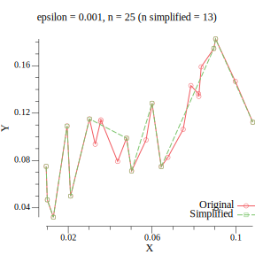

# Carto


[](https://pkg.go.dev/github.com/muktihari/carto)
[](https://codecov.io/gh/muktihari/carto)
[](https://goreportcard.com/report/github.com/muktihari/carto)

This project hosts the implementation of various Cartography algorithms in Go.

## Import

```sh
go get github.com/muktihari/carto
```

## List of algorithms:

- [Ramer–Douglas–Peucker](https://w.wiki/B6U3) [[github.com/muktihari/carto/rdp](./rdp/rdp.go)]: Simplifies a curve by reducing the number of points in a curve composed of line segments, resulting in a similar curve with fewer points. It's a zero-alloc implementation that performs efficiently by reslicing the input **points**.

  

  Benchmark (n = 1000 points):

  ```js
  goos: linux; goarch: amd64; pkg: github.com/muktihari/carto/rdp
  cpu: Intel(R) Core(TM) i5-5257U CPU @ 2.70GHz
  BenchmarkSimplify-4   6428   161746 ns/op   0 B/op   0 allocs/op
  PASS
  ok      github.com/muktihari/carto/rdp  1.065s
  ```
